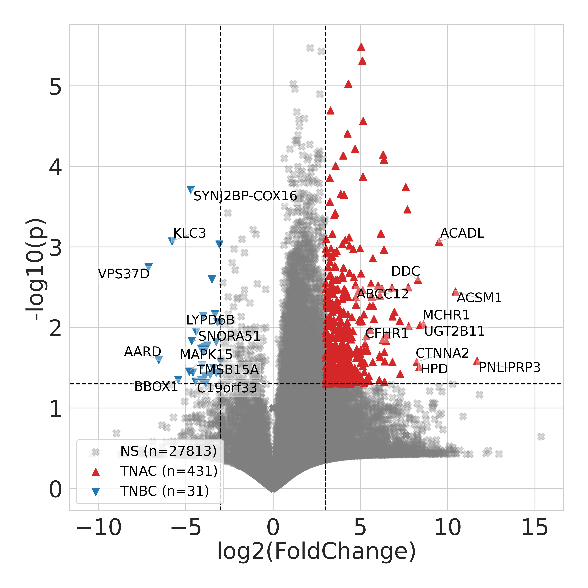
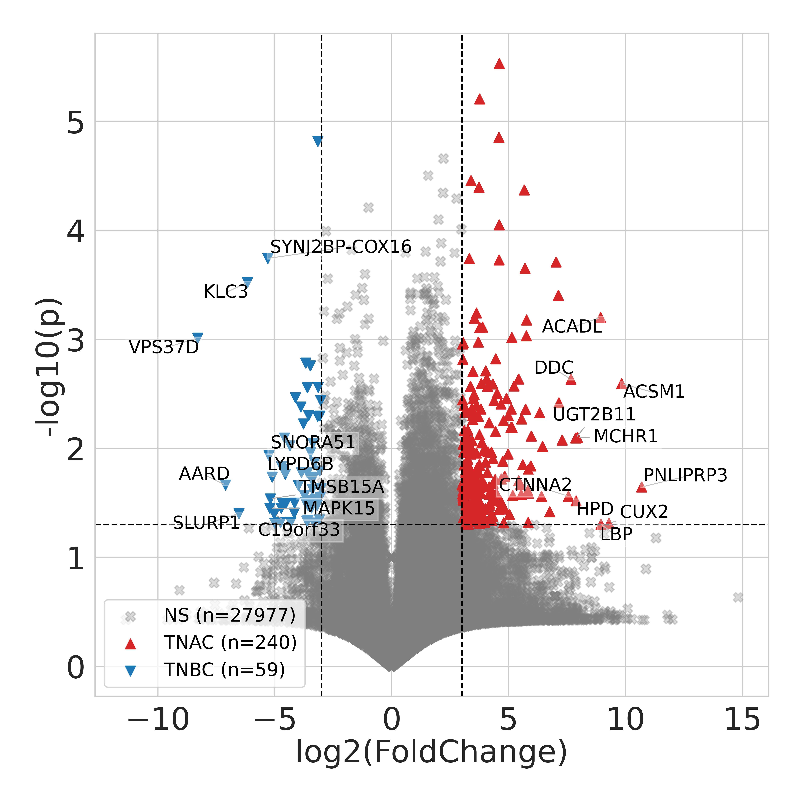
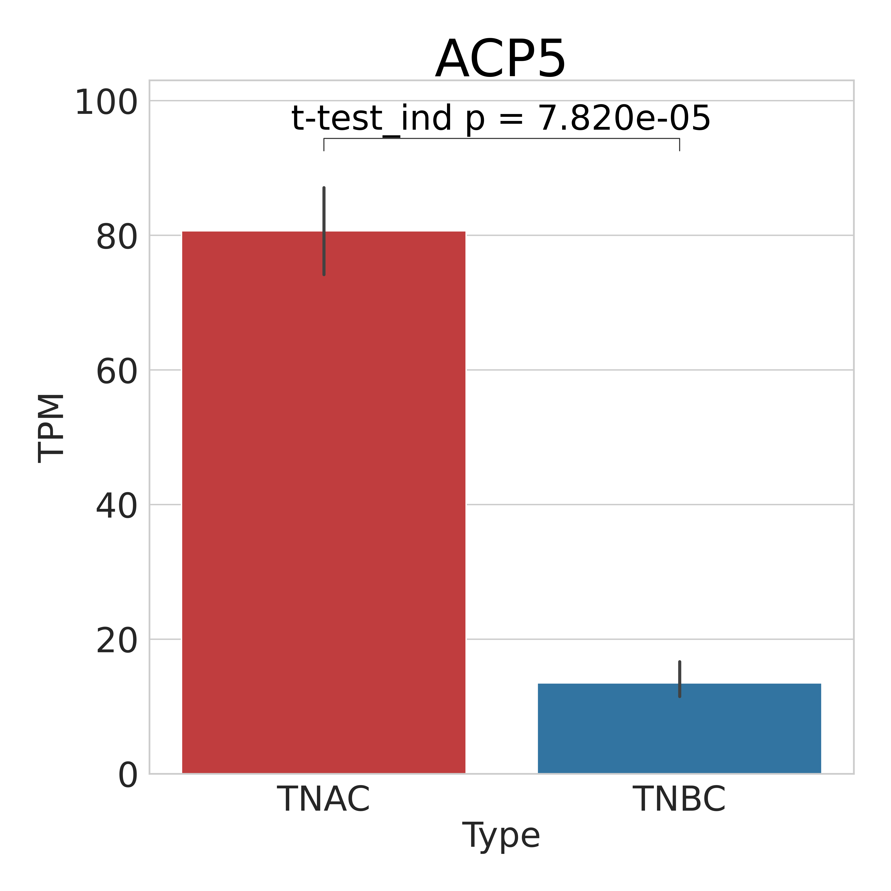
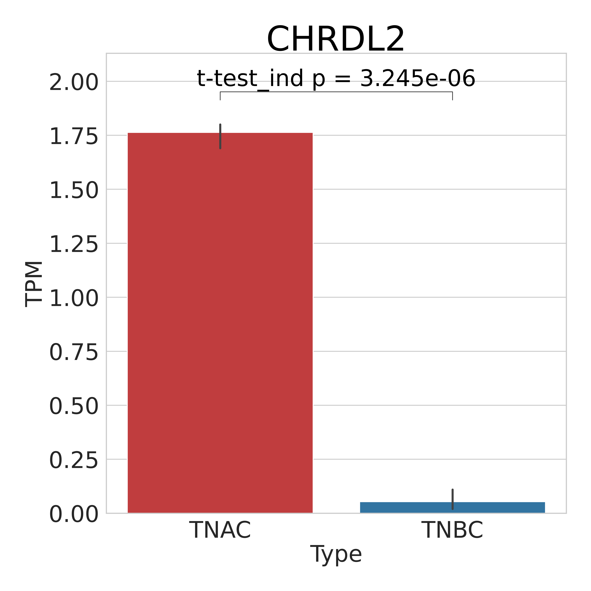
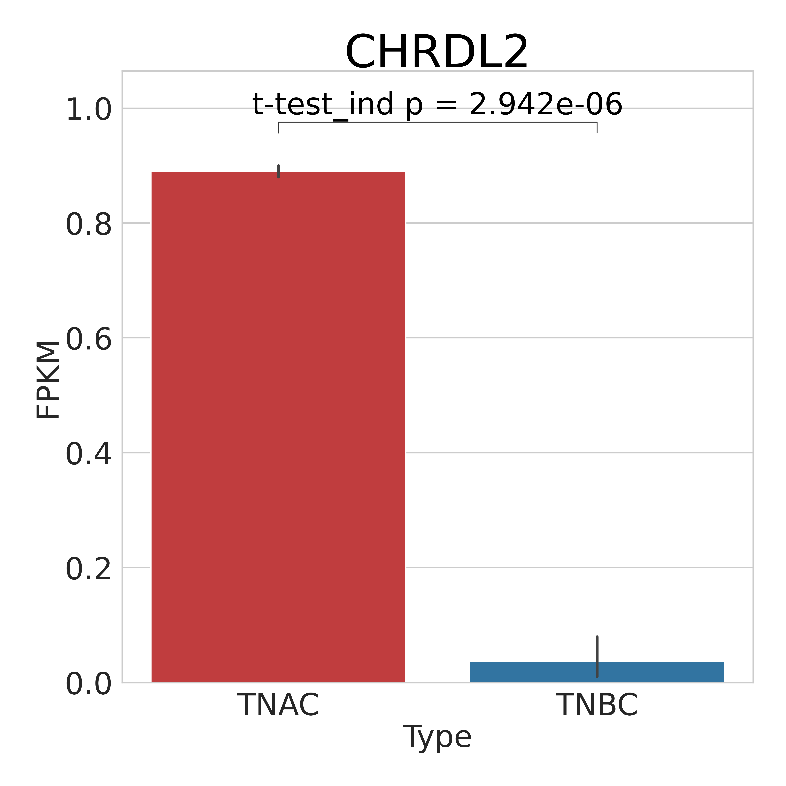
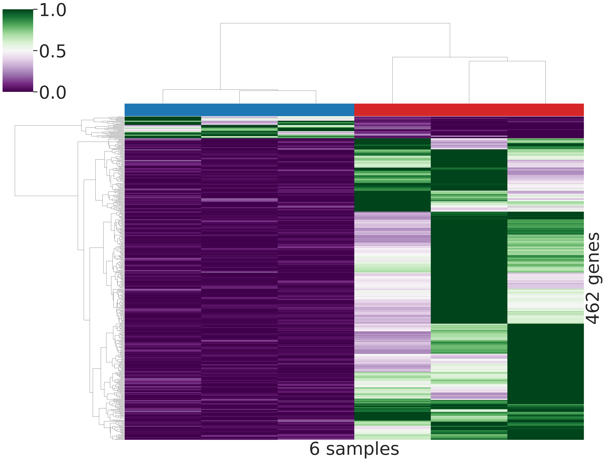
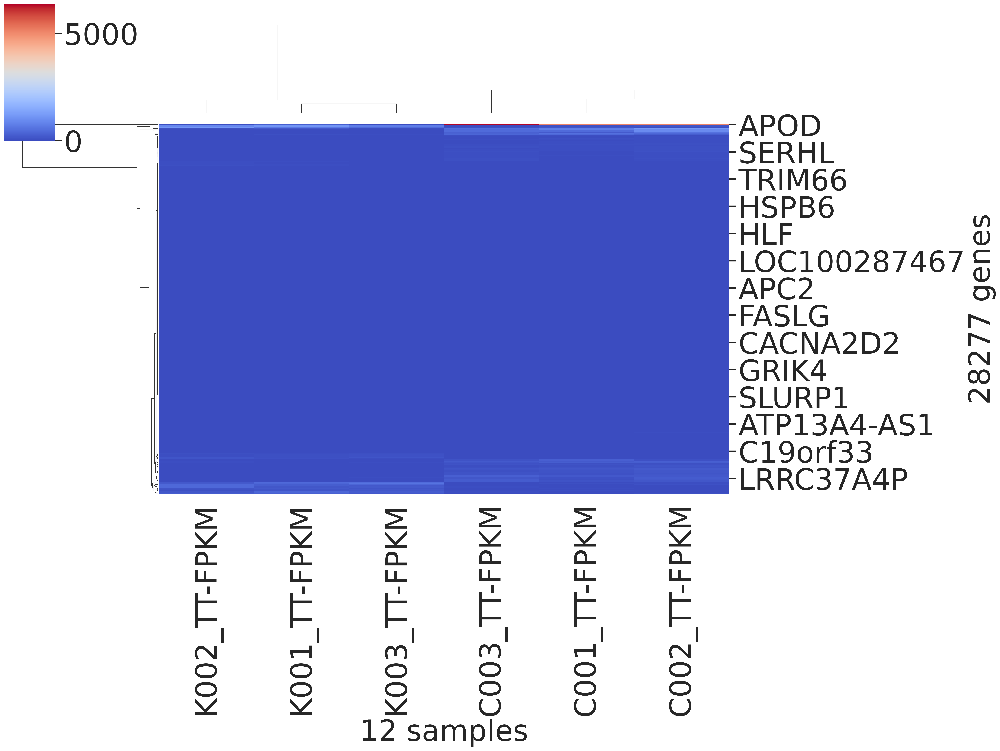

# Pathway prediction

This module merges RSEM `*.genes.results` files and creates expression-based
plots and pathway-enrichment plots for the TNAC and TNBC sample groups used in
this project.

The plotting scripts currently use these hard-coded groups:

- TNAC: `C001_TT`, `C002_TT`, `C003_TT`
- TNBC: `K001_TT`, `K002_TT`, `K003_TT`

The merged expression table must therefore contain columns named like
`C001_TT-TPM`, `C001_TT-FPKM`, `K001_TT-TPM`, and `K001_TT-FPKM`.

## Example plots

The `example/` folder contains rendered examples for volcano, significant-gene
bar, heatmap, and pathway-enrichment plots. PDF versions are also available for
each example.

### Volcano plots

<p>
  
  
</p>

### Significant-gene bar plots

<p>
  
  
  
</p>

### Heatmaps

<p>
  
  
</p>

### Pathway enrichment plots

<p>
  
  
</p>
<p>
  
  
</p>

## Setup

Run commands from this directory:

```bash
cd 07_Pathway_prediction
bash 07_1_setup_venv.bash
source ./bin/activate
bash 07_2_install_dependency.bash
```

Useful commands:

- Activate: `source ./bin/activate`
- Deactivate: `deactivate`

## 1. Merge RSEM expression outputs

Execute the example wrapper:

```bash
bash 07_3_merge_expression.bash
```

Or run directly:

```bash
python3 07_3_merge_expression.py \
    $(realpath ../05_RNAseq_gene_expression/*.genes.results) \
    "$PWD/expression.tsv"
```

Arguments:

- `input`: one or more RSEM `*.genes.results` files.
- `output`: merged TSV file.

The sample name is taken from the input filename before the first dot.

## 2. Draw volcano plots

Create the output directory first:

```bash
mkdir -p Volcano
python3 07_4_draw_volcano.py \
    "$(realpath ./expression.tsv)" \
    "$(realpath ./Volcano)"
```

This writes `TPM.pdf`, `TPM.png`, `FPKM.pdf`, and `FPKM.png`.

## 3. Draw significant-gene bar plots

Create the output directory first:

```bash
mkdir -p Bar
python3 07_5_draw_bar.py \
    "$(realpath ./expression.tsv)" \
    "$(realpath ./Bar)"
```

The script writes a PDF and PNG for each gene that passes the built-in t-test
threshold.

## 4. Draw heatmaps

Create the output directory first:

```bash
mkdir -p Heatmap
python3 07_6_draw_heatmap.py \
    "$(realpath ./expression.tsv)" \
    "$(realpath ./Heatmap)"
```

This writes clustered heatmaps for `TPM` and `FPKM`.

## 5. Check pathway enrichment

Create the output directory first:

```bash
mkdir -p Pathway
python3 07_7_check_pathway.py \
    "$(realpath ./expression.tsv)" \
    "$(realpath ./Pathway)"
```

This writes pathway-enrichment plots for `TPM` and `FPKM`, split by TNAC and
TNBC direction.

Important: this step sends gene lists to the Enrichr web API at
`maayanlab.cloud` and uses the `KEGG_2026` background. It requires internet
access and should not be run with restricted gene lists unless external upload
is permitted.

## Expected outputs

- `expression.tsv`
- `Volcano/TPM.pdf`, `Volcano/TPM.png`, `Volcano/FPKM.pdf`,
  `Volcano/FPKM.png`
- `Bar/<gene>-TPM.pdf`, `Bar/<gene>-TPM.png`, `Bar/<gene>-FPKM.pdf`,
  `Bar/<gene>-FPKM.png`
- `Heatmap/TPM.pdf`, `Heatmap/TPM.png`, `Heatmap/FPKM.pdf`,
  `Heatmap/FPKM.png`
- `Pathway/TPM-TNAC.pdf`, `Pathway/TPM-TNAC.png`,
  `Pathway/TPM-TNBC.pdf`, `Pathway/TPM-TNBC.png`
- `Pathway/FPKM-TNAC.pdf`, `Pathway/FPKM-TNAC.png`,
  `Pathway/FPKM-TNBC.pdf`, `Pathway/FPKM-TNBC.png`
