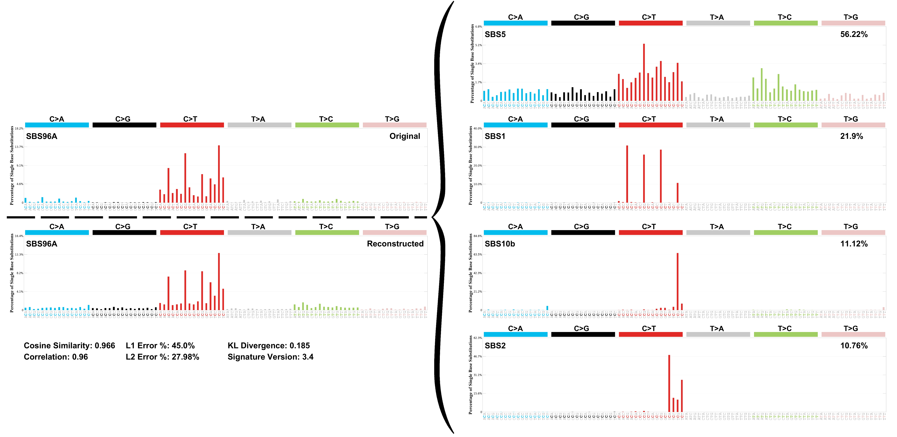

# Mutational signatures

This module runs SigProfiler MatrixGenerator, Extractor, and Plotting on PASS
VCF files from `03_Somatic_short_variant_discovery`.

## Example plots

The `example/` folder contains rendered examples from SigProfiler outputs.
PDF versions are also available for the SBS6, COSMIC SBS96, and SBS96
decomposition examples.

### Sample SBS96 plot


### Sample DBS78 plot


### Extracted SBS6 signatures


### COSMIC SBS96 signatures


### SBS96 decomposition



## SigProfiler

- Web: https://cancer.sanger.ac.uk/signatures/tools/
- GitHub: https://github.com/SigProfilerSuite/SigProfilerExtractor
- Paper: https://doi.org/10.1038/s41586-020-1943-3

## Setup

Run commands from this directory:

```bash
cd 08_Mutational_signatures
ln -snfv ../pipeline_utils.py .
bash 08_1_setup_venv.bash
source ./bin/activate
bash 08_2_install_dependency.bash
```

Useful commands:

- Activate: `source ./bin/activate`
- Deactivate: `deactivate`

The current script uses shared SigProfiler reference files from
`/BiO/Teach/Standard-Pipeline/08_Mutational_signatures`. Confirm that path is
available on the server before running. PASS VCF files are linked from
`../03_Somatic_short_variant_discovery/*.PASS.vcf` into `input/`.

## Execute with the example wrapper

```bash
bash 08_3_SigProfiler.bash
```

## Execute directly

Generate SLURM scripts without submitting:

```bash
python3 -B 08_3_SigProfiler.py --dryrun \
    "$(realpath .)" \
    "$(realpath .)"
```

Submit the workflow:

```bash
python3 -B 08_3_SigProfiler.py \
    "$(realpath .)" \
    "$(realpath .)"
```

Arguments:

- `input`: SigProfiler virtual-environment directory. The example uses the
  current directory.
- `output`: output directory. The example uses the current directory.
- `--config`: config INI file. Defaults to `../config.ini`.
- `--dryrun`: create scripts in `sh/` without calling `sbatch`.

## Submitted job order

1. `1.refer_reference`
2. `2.matrix_generator`
3. `3.extractor`
4. `4.plotting`

Each job is submitted with an `afterok` dependency on the previous job.

## Expected outputs

- `input/` containing links to somatic PASS VCF files
- `SBS/`
- `DBS/`
- `ID/`
- `Plot/`
- generated scripts in `sh/`
- SLURM logs in `stdeo/`
