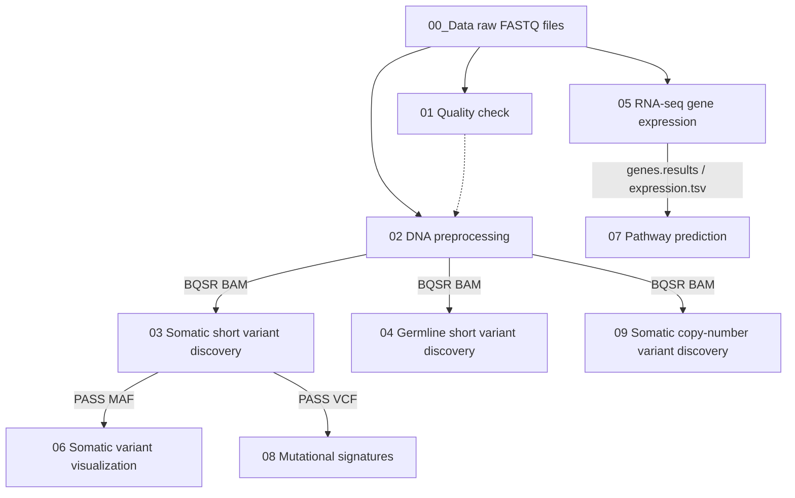

# Standard-Pipeline

Standard analysis pipeline used within CompBio@UNIST.

The repository is organized as numbered workflow modules. Each module contains
small `.bash` examples and one or more Python entry points. Most Python entry
points create SLURM job scripts in `sh/`, write SLURM logs to `stdeo/`, and
submit the jobs with `sbatch`. Use `--dryrun` when you want to generate the
job scripts without submitting them.

## Table of contents

- [Repository layout](#repository-layout)
- [Requirements](#requirements)
- [Data](#data)
- [Common setup](#common-setup)
- [How to execute a module](#how-to-execute-a-module)
- [Suggested execution order](#suggested-execution-order)
- [Outputs and cleanup](#outputs-and-cleanup)
- [Policy](#policy)
- [Maintainer](#maintainer)

## Repository layout

| Directory | Purpose |
| --- | --- |
| `01_Quality_check` | Run FastQC on raw FASTQ files. |
| `02_Data_pre-processing_for_variant_discovery` | Align WES DNA reads, sort, mark duplicates, and apply BQSR. |
| `03_Somatic_short_variant_discovery` | Call somatic SNVs/indels with Mutect2 and convert PASS variants to MAF. |
| `04_Germline_short_variant_discovery` | Call germline variants with HaplotypeCaller and convert PASS variants to MAF. |
| `05_RNAseq_gene_expression` | Build an RSEM reference and quantify RNA-seq expression. |
| `06_Somatic_variant_visualization` | Merge somatic MAF files and draw comut, rainfall, and lollipop plots. |
| `07_Pathway_prediction` | Merge RSEM expression results and draw volcano, bar, and heatmap plots. |
| `08_Mutational_signatures` | Run SigProfiler matrix generation, extraction, and plotting. |
| `09_Somatic_copy_number_variant_discovery` | Prepare and run PureCN copy-number analysis. |

## Requirements

Run the pipeline on a Linux server with SLURM, `bash`, `python3`, and the tools
listed in `config.ini`. The default configuration is maintained for the
CompBio server and points to shared locations under `/BiO/Share/Tools` and
`/BiO/Share/Tools/gatk-bundle/hg38`.

Before running on another server, edit these sections in `config.ini`:

- `[DEFAULT]`: `threads`, `memory`, and `java_options`
- `[TOOLS]`: executable paths for BWA, Bowtie2, GATK, FastQC, samtools,
  Picard, vcf2maf, VEP, STAR, RSEM, bgzip, and tabix
- `[REFERENCES]`: FASTA, GTF, VCF, interval, and BED reference files
- `[SLURM]`: mail notification options

## Data

Breast cancer data published in [the paper](https://doi.org/10.1038/s12276-023-01030-z).

- TNBC: **K**
- TNAC: **C**

Create the expected input-data link at the repository root:

```bash
ln -sv /BiO/Store/UNIST-ApocrineCarcinoma-SMC-2021-04 00_Data
```

The example `.bash` files assume this `00_Data` link exists and that commands
are run from each numbered module directory.

If your `realpath` command requires paths to exist, use `$PWD/<new-output>` for
new output files or basenames. Use `realpath` only for existing inputs and
existing output directories.

## Common setup

Several modules import `pipeline_utils.py` from their own directory. Create a
symbolic link before running those modules:

```bash
cd 01_Quality_check
ln -snfv ../pipeline_utils.py .
```

Repeat the same command inside modules that use `pipeline_utils.py`
(`01`, `02`, `03`, `04`, `05`, `08`, and `09`). You may also create links for
all numbered modules from the repository root:

```bash
for module in 01_Quality_check 02_Data_pre-processing_for_variant_discovery 03_Somatic_short_variant_discovery 04_Germline_short_variant_discovery 05_RNAseq_gene_expression 08_Mutational_signatures 09_Somatic_copy_number_variant_discovery; do
    cd "$module"
    ln -snfv ../pipeline_utils.py .
    cd ..
done
```

## How to execute a module

1. Move into the module directory.
2. Create the `pipeline_utils.py` link when the module requires it.
3. Check or edit the example `.bash` file so the input sample paths match your
   data.
4. Run the `.bash` file, or call the Python entry point directly.
5. Use `--dryrun` first if you want to inspect generated SLURM scripts before
   submitting jobs.

Example:

```bash
cd 02_Data_pre-processing_for_variant_discovery
ln -snfv ../pipeline_utils.py .
python3 -B 02_1_BWA.py --dryrun \
    "$(realpath ../00_Data/WES/merge/C001_TN_DNA_R1.fastq.gz)" \
    "$(realpath ../00_Data/WES/merge/C001_TN_DNA_R2.fastq.gz)" \
    "$(realpath .)"
```

Remove `--dryrun` to submit the generated jobs with `sbatch`:

```bash
python3 -B 02_1_BWA.py \
    "$(realpath ../00_Data/WES/merge/C001_TN_DNA_R1.fastq.gz)" \
    "$(realpath ../00_Data/WES/merge/C001_TN_DNA_R2.fastq.gz)" \
    "$(realpath .)"
```

Most Python scripts accept `--config ../config.ini`; this is also the default
when commands are run from the module directory.

## Suggested execution order

Run only the modules needed for your analysis, but the usual WES/RNA-seq flow is:

1. `01_Quality_check`
2. `02_Data_pre-processing_for_variant_discovery`
3. `03_Somatic_short_variant_discovery`
4. `04_Germline_short_variant_discovery`
5. `05_RNAseq_gene_expression`
6. `06_Somatic_variant_visualization`
7. `07_Pathway_prediction`
8. `08_Mutational_signatures`
9. `09_Somatic_copy_number_variant_discovery`

Dependency map:



The dotted edge from `01_Quality_check` to
`02_Data_pre-processing_for_variant_discovery` is a recommended QC review gate,
not a direct file dependency. The other edges show the main output files used by
downstream modules.

Each module README contains concrete commands, required inputs, and expected
outputs.

## Outputs and cleanup

Pipeline-managed modules create:

- `sh/*.sh`: generated SLURM job scripts
- `stdeo/*.txt`: SLURM stdout/stderr logs
- analysis outputs in the module directory or the output directory passed on
  the command line

Cleanup helpers:

```bash
make clean
make purge
```

`make clean` removes generated `*.sh` and `*.txt` files. `make purge` also
removes generated `*.bam` files, so use it only when you intentionally want to
delete alignment outputs.

## Policy

1. Use long options, which start with `--`, rather than short options for
   readability.

## Maintainer

Jaewoong Lee (jaewoong at unist dot ac dot kr)
